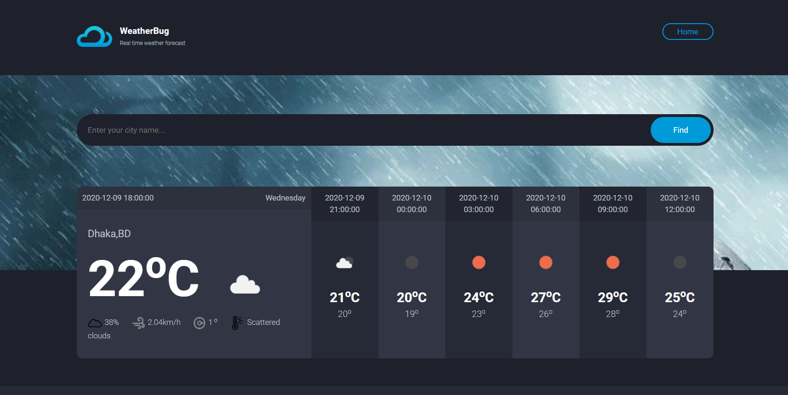

Weathercast Using Python and Django 
*Weather Bug is the application of science and technology to predict the conditions of the atmosphere for a given location and time. You can get the realtime Weather forecasting by using this web application*

Mr. Nirmalkumar Arvind Kadam.     PRN.2067571242013
Mr. Pramod Harishchandra Shirke.  PRN.2067571242015
Mr. Rohit Shivaji Wagh.           PRN.2067571242023
Mr. Raviraj Ashok Katkar          PRN.2067571242022
-->

## Requirements
1.  Python 3+
2.  Django 3+

## Setup, Installation and Run

To run the app on your local machine, you need Python 3+, installed on your computer. Follow all the steps to run this project.
   
1.  Create `venv` virtual environment:
```bash
pip install venv virtual_env_name
```
    
2.  Activate `venv` virtual environment:
```bash
source virtual_env_name/Scripts/activate
```


```

4. Then enter the corresponding directory:
```bash
cd Weather_App--Python-Django
```
    
5. Install all the requirements using pip:
```bash
pip install -r requirements.txt
``` 

6.	Run server:
```bash
python manage.py runserver
```

# Tools
## Front-end Part
* HTML
* CSS
* Bootstrap
* JavaScript

# Screenshots of the Project
<p align="center">
  
  
</p>


